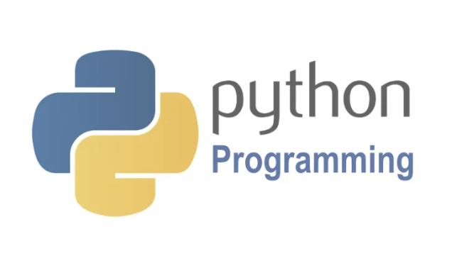

    

---

Pengenalan praktek pertama memulai pemrograman python:

   - <a href="./belajar-python">Link to view entire python belajar</a>

   - <a href="./belajar-findDuplicate">Link to view entire python findDuplicate</a>

